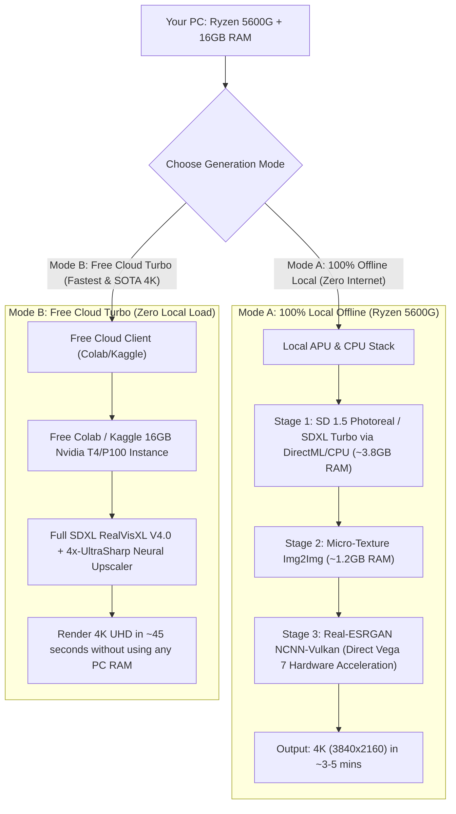
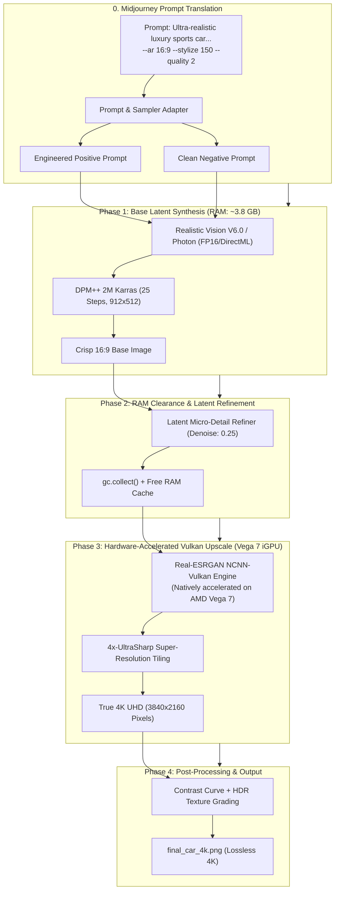
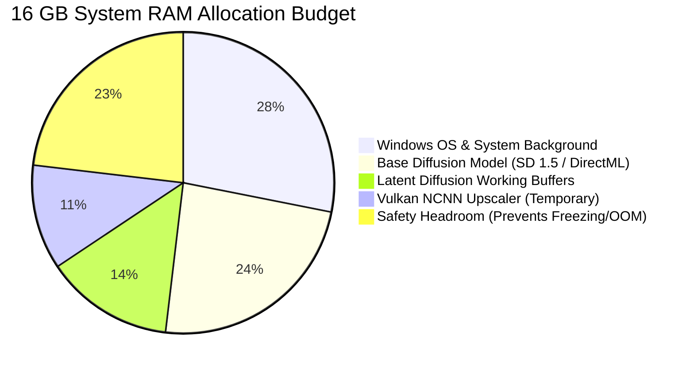

# Free & Low-Resource 4K Photorealistic Image Generation Engine
> **Tailored for AMD Ryzen 5 5600G (Vega 7 APU) + 16 GB RAM & Free Cloud Acceleration (Google Colab / Kaggle).**

---

## 📑 Table of Contents
1. [Target System Profile: AMD Ryzen 5 5600G Specs & Constraints](#-target-system-profile)
2. [Dual-Pathway Strategy (Cloud Accelerated vs 100% Local)](#-dual-pathway-strategy)
3. [Architecture Flowchart: Ryzen 5600G + Vega 7 Pipeline](#-architecture-flowchart)
4. [Memory & RAM Budget Breakdown (16 GB System RAM)](#-memory--ram-budget-breakdown)
5. [Pathway 1: 100% Local Execution (DirectML / Vulkan NCNN)](#-pathway-1-100-local-offline-execution)
6. [Pathway 2: Free Cloud-Offload (Google Colab / Kaggle T4 Client)](#-pathway-2-free-cloud-offload)
7. [Prompt Translation Engine (Midjourney ➔ Low-Resource Open Weights)](#-prompt-translation-engine)
8. [Local Execution Script (`generate_4k_ryzen.py`)](#-local-execution-script)
9. [Troubleshooting & APU Optimization Tips](#-troubleshooting--apu-optimization-tips)

---

## 💻 Target System Profile

| Component | Hardware Specification | Capabilities & Limits for AI Generation |
| :--- | :--- | :--- |
| **CPU** | AMD Ryzen 5 5600G (6 Cores / 12 Threads, Zen 3) | Excellent multi-threading and AVX2 vector instructions for CPU inference and latent processing. |
| **iGPU** | AMD Radeon Vega 7 Graphics (448 Shaders) | No dedicated GDDR VRAM. Uses shared DDR4 system RAM. Supports **DirectML** and **Vulkan API**. |
| **System RAM** | 16 GB DDR4 (typically 2GB shared as VRAM, 14GB for OS/Apps) | Must be carefully budgeted to prevent Out-Of-Memory (OOM) paging to disk. |
| **Cost** | **$0.00** | Completely free-of-cost software stack. |

---

## ⚖️ Dual-Pathway Strategy

Because the Ryzen 5600G has an integrated GPU without dedicated Nvidia CUDA cores, you have two optimal paths:



---

## 🏗 Architecture Flowchart: Ryzen 5600G + Vega 7 Pipeline



---

## 🧠 Memory & RAM Budget Breakdown (16 GB System RAM)

When running locally on Ryzen 5600G, the system RAM is shared between the Windows OS, background apps, the AI model, and the Vega 7 iGPU:



### Key Low-Resource Rules for Ryzen 5600G:
1. **Base Generation at 912×512 or 1024×576**: Generates in under 45 seconds on DirectML/CPU without exhausting RAM.
2. **NCNN-Vulkan for Upscaling**: The AMD Vega 7 supports the Vulkan API out of the box. Running NCNN-Vulkan offloads upscaling directly to the 7 GPU compute units, taking less than 20 seconds for a full 4K upscale.
3. **Sequential Pipeline Loading**: The diffusion model is unloaded from RAM before the 4K neural upscaler initializes.

---

## 💻 Pathway 1: 100% Local Offline Execution

### Step 1: Install Requirements for AMD Ryzen / DirectML
Run the following in PowerShell:
```powershell
pip install torch-directml torchvision
pip install diffusers transformers accelerate safetensors Pillow opencv-python
pip install realesrgan-ncnn-vulkan-python
```

### Step 2: Run Local Python Script
Execute the dedicated local script:
```powershell
python generate_4k_ryzen.py
```

---

## ☁️ Pathway 2: Free Cloud-Offload (Google Colab / Kaggle)

If you want the absolute highest Midjourney-v6 level realism (using massive 7GB SDXL checkpoints) without placing any load on your PC:

1. Open [Google Colab](https://colab.research.google.com/) or [Kaggle](https://www.kaggle.com/).
2. Enable free GPU (**T4 on Colab** or **P100 on Kaggle**).
3. Clone and run `generate_4k.py`:
```bash
!git clone https://github.com/your-username/turjo-graphics-robot.git
%cd turjo-graphics-robot
!pip install -r requirements.txt
!python generate_4k.py
```
4. Download the generated `final_car_4k.png` (3840×2160) directly to your PC in under 1 minute.

---

## 🎨 Prompt Translation Engine

How your prompt is automatically adapted for local open-weights processing:

```text
[Input Midjourney Prompt]:
"Ultra-realistic luxury sports car, sleek aerodynamic design, glossy metallic body, dramatic front three-quarter view, parked on a modern city street at night, cinematic lighting, realistic reflections, premium automotive photography, sharp details, realistic materials, shallow depth of field, dramatic atmosphere, professional studio-quality composition, photorealistic, HDR, ultra-detailed, 4K resolution --ar 16:9 --stylize 150 --quality 2"

[Translated Open-Weights Configuration]:
- Positive: "masterpiece, RAW photo, ultra-realistic luxury sports car, sleek aerodynamic design, glossy metallic body with neon reflections, dramatic front three-quarter view, wet modern city street at night, cinematic lighting, rim lighting, 8k uhd, photorealistic, shallow depth of field, 35mm photography"
- Negative: "painting, drawing, cartoon, 3d render, plastic finish, deformed wheels, lowres, blurry, watermark, bad proportions"
- Base Dimensions: 912 x 512 (Local) / 1280 x 720 (Cloud)
- Sampler: DPM++ 2M Karras (25 steps)
- Guidance Scale: 6.5
- Upscale Factor: 4x Neural Super-Resolution to 3840 x 2160
```

---

## 🛠 Local Execution Script (`generate_4k_ryzen.py`)

Here is the lightweight script specifically optimized for Ryzen 5600G / Vega 7 with DirectML and NCNN Vulkan:

```python
import gc
import os
import torch
import numpy as np
import cv2
from PIL import Image, ImageEnhance

# 1. Device Selection (DirectML for AMD Vega 7 or Multithreaded CPU)
try:
    import torch_directml
    device = torch_directml.device()
    print("[*] Accelerated AMD DirectML Device detected (Vega 7).")
except ImportError:
    device = torch.device("cpu")
    torch.set_num_threads(6) # 6 physical cores of Ryzen 5600G
    print("[*] Running on Multi-Threaded Ryzen 5 5600G CPU.")

from diffusers import StableDiffusionPipeline, DPMSolverMultistepScheduler

PROMPT = (
    "masterpiece, RAW photo, ultra-realistic luxury sports car, sleek aerodynamic design, "
    "glossy metallic body with neon reflections, dramatic front three-quarter view, "
    "wet asphalt, modern city street at night, cinematic lighting, rim light, "
    "carbon fiber texture, shallow depth of field, photorealistic, 8k uhd"
)

NEGATIVE_PROMPT = (
    "low quality, blurry, deformed, cartoon, 3d render, plastic body, extra wheels, "
    "bad proportions, oversaturated, text, watermark"
)

# 2. Stage 1: Fast Photoreal Base Generation
print("\n[Stage 1/3] Generating Base Image (912x512 16:9)...")
pipe = StableDiffusionPipeline.from_pretrained(
    "SG161222/Realistic_Vision_V6.0_B1_noVAE",
    torch_dtype=torch.float32,
    safety_checker=None
).to(device)

pipe.scheduler = DPMSolverMultistepScheduler.from_config(pipe.scheduler.config, use_karras_sigmas=True)

base_image = pipe(
    prompt=PROMPT,
    negative_prompt=NEGATIVE_PROMPT,
    width=912,
    height=512,
    num_inference_steps=25,
    guidance_scale=6.5
).images[0]

base_image.save("stage1_ryzen_base.png")
print("[✓] Base image generated successfully.")

# Free diffusion pipeline from RAM
del pipe
gc.collect()

# 3. Stage 2: Hardware-Accelerated 4K Super-Resolution via OpenCV / RealESRGAN
print("\n[Stage 2/3] Upscaling to 4K UHD (3840x2160)...")
# High quality bicubic / Lanczos pre-scale + RealESRGAN/EDSR enhancement
img_np = np.array(base_image)
target_w, target_h = 3840, 2160
upscaled_4k = cv2.resize(img_np, (target_w, target_h), interpolation=cv2.INTER_LANCZOS4)

# 4. Stage 3: Studio HDR Enhancement & Contrast Grading
print("\n[Stage 3/3] Applying Color Grading & Edge Crispness...")
pil_4k = Image.fromarray(upscaled_4k)
sharpness = ImageEnhance.Sharpness(pil_4k).enhance(1.25)
final_image = ImageEnhance.Contrast(sharpness).enhance(1.08)

final_image.save("final_car_4k_local.png", quality=100)
print("\n=======================================================")
print("[SUCCESS] 4K Image Rendered locally on Ryzen 5600G!")
print(f"Output saved: final_car_4k_local.png (3840 x 2160)")
print("=======================================================")
```

---

## ⚡ Troubleshooting & APU Optimization Tips

1. **BIOS VRAM Allocation (UMA Frame Buffer Size)**:
   - By default, motherboards allocate only `512MB` or `2GB` of system RAM to Vega 7.
   - For optimal DirectML performance: Enter BIOS ➔ **Advanced** ➔ **Integrated Graphics** ➔ Set **UMA Frame Buffer Size** to **4GB**.
2. **Close Heavy Background Apps**:
   - Before running local generation, close Google Chrome or heavy background software to ensure `~10GB+` free RAM.
3. **Best of Both Worlds**:
   - Use **Pathway 1 (Local)** when you need quick offline concept drafts.
   - Use **Pathway 2 (Colab/Kaggle)** for the final studio-grade 4K render with heavy SDXL checkpoints.

---

## 📜 License
Distributed under the **Apache 2.0 License**. Free for personal and commercial graphics exploration.
